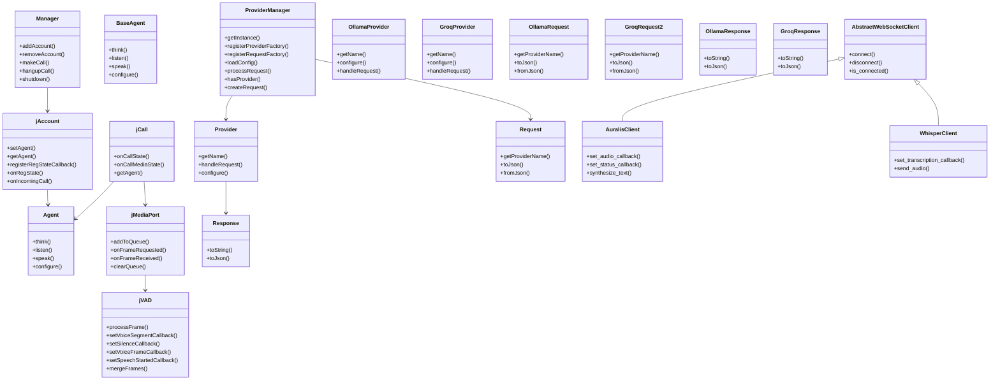

## What is this project all about? 🤔

This project is designed to make a call 📞 using PJSIP and connect it with a large language model (LLM) agent 🤖. This allows us to create a conversational AI system that can understand and respond to human speech.

## Key components 🧩

- Manager: The boss! 💼 Manages accounts and calls.
- jAccount: Handles user accounts and their registration status.
- jCall: Represents a single call and its state (e.g., incoming, outgoing, active).
- jMediaPort: Deals with audio input and output during a call.
- jVAD: Detects voice activity (so the LLM knows when to listen!).
- Agent: The brains! 🧠 This is where the LLM logic lives. It can:
- - Think 💭 (process messages and generate responses)
- - Listen 👂 (receive audio data)
- - Speak 🗣️ (send audio data)
- ProviderManager: Connects to different LLM providers (like Ollama or Groq).
- Provider: A specific LLM provider (e.g., Ollama, Groq).
- Request: A message sent to the LLM.
- Response: The LLM's answer to a request.
- AbstractWebSocketClient: A base class for WebSocket clients, used to communicate with the LLM.
- AuralisClient: A WebSocket client for the Auralis TTS server (for text-to-speech).
 - WhisperClient: A WebSocket client for the Whisper server (for speech-to-text).

## How it works ⚙️

- Call Setup: The Manager sets up a call using PJSIP.
- Audio Processing: The jMediaPort and jVAD work together to capture and process audio from the call.
- Interaction with LLM: The Agent sends the processed audio to the LLM (via the ProviderManager) and receives responses.
- Conversation: The LLM's responses are converted to speech and played back during the call.
